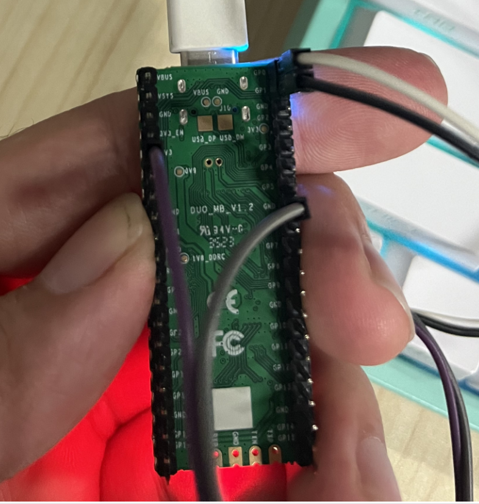

# milkv-duo-lsm6dsr

## 使用方法

### 1. 克隆仓库

```shell
$ git clone git@github.com:GrootLiu/milkv-duo-lsm6dsr.git
$ cd milkv-duo-lsm6dsr/i2c-module/
```

### 2. 修改交叉编译器路径

更改目录中的 `Makefile`，将 `SDK_DIR` 中的 `/path/to/duo-buildroot-sdk` 改为之前克隆的 `duo-buildroot-sdk` 的绝对路径。

### 3. 生成驱动

```shell
$ make 
```

检查是否生成两个文件：`i2c-lsm6dsr.ko` 和 `lsm6dsr-app`。

### 4. 连接陀螺仪与开发板




### 5. 安装驱动

将上面的两个文件拷贝到 `milkv-duo` 中，将 `lsm6dsr` 模块连接到 `milkv-duo` 上。

ssh 进入 `milkv-duo`，执行下面的命令：

```shell
$ insmod i2c-lsm6dsr.ko
```
执行下面的命令，查看驱动是否安装成功：


如果符合上面红框标出的行为，并且输入 dmesg 命令后没有 `error` 或 `failed`，则说明驱动安装成功。

### 6. 测试驱动

```shell
$ chmod +x lsm6dsr-app
$ ./lsm6dsr-app
```

如果出现以下内容，表明驱动测试通过：

